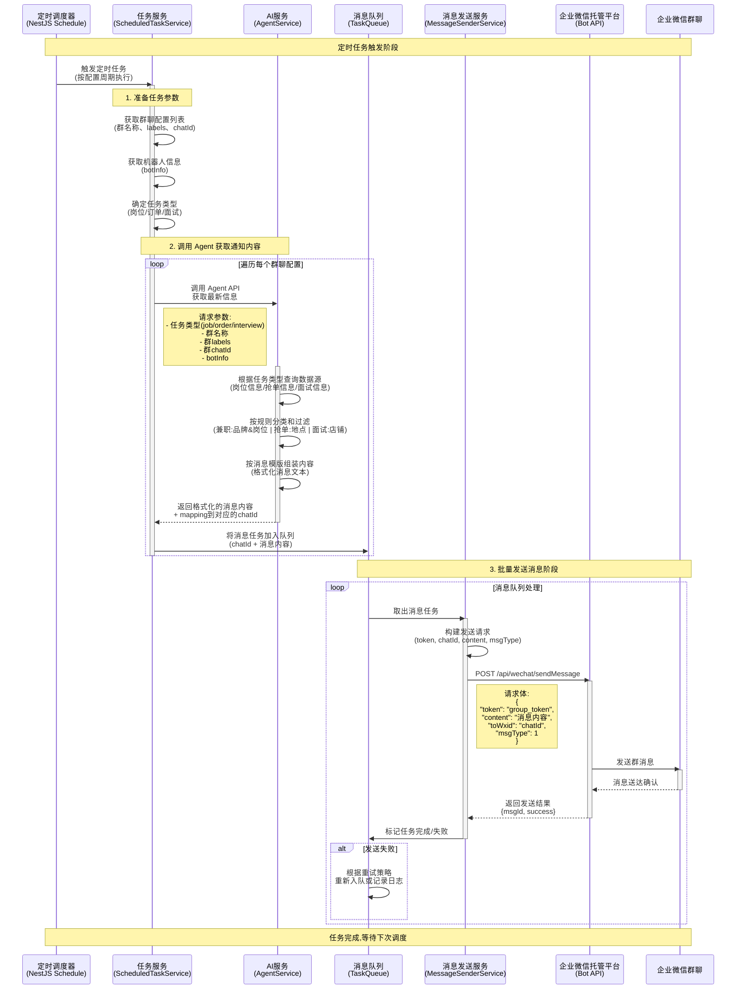
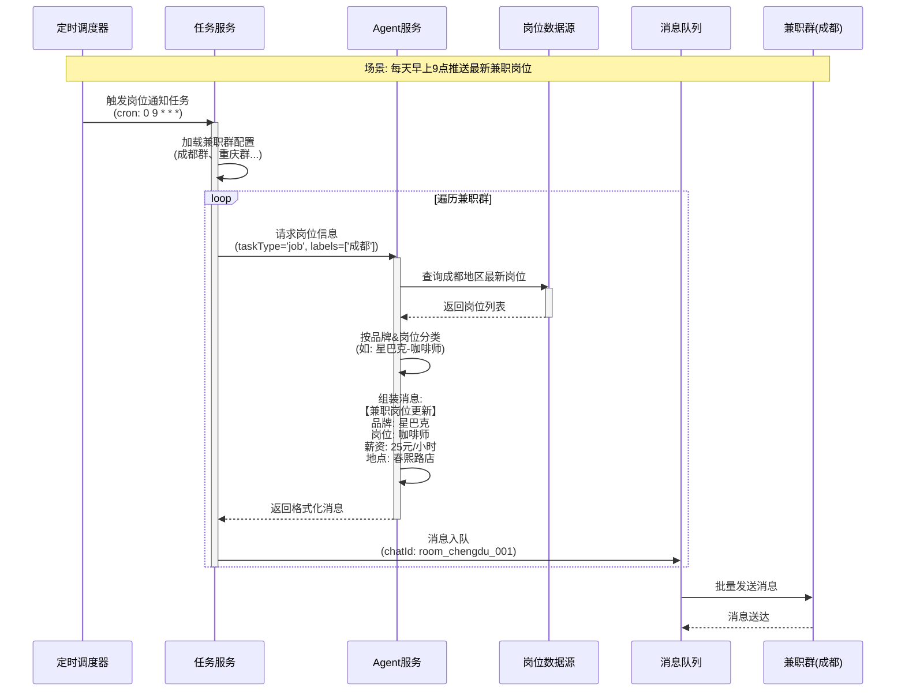
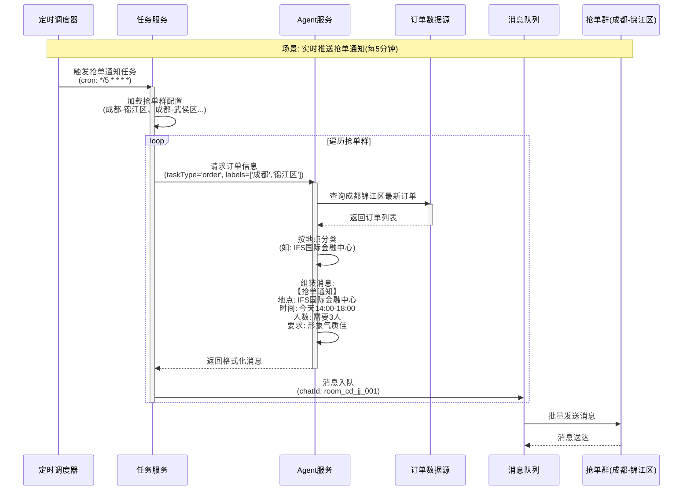
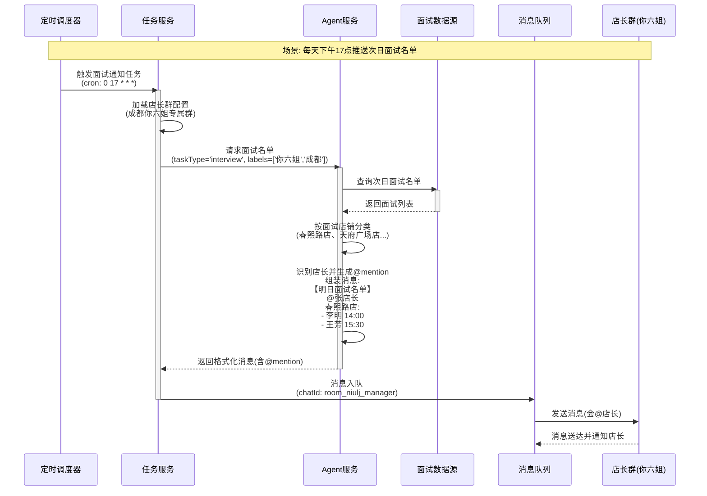

# 定时任务时序图 - 群聊通知系统

## 系统概述

该定时任务用于主动向企业微信群聊推送三种类型的通知:
1. **兼职群** - 岗位通知(按城市划分,信息按品牌&岗位分类)
2. **抢单群** - 订单通知(按城市&区级划分,信息按地点分类)
3. **店长群** - 面试通知(成都你六姐专属群,根据面试店@店长)

---

## 整体时序图



---

## 详细说明

### 阶段一: 定时任务触发

**触发器**: NestJS Schedule 模块的 `@Cron()` 装饰器

**执行流程**:
1. 定时调度器按配置的 cron 表达式触发任务
2. 调用 `ScheduledTaskService` 的任务处理方法

### 阶段二: Agent 调用获取通知内容

**输入参数**:
```typescript
{
  taskType: 'job' | 'order' | 'interview',  // 任务类型
  groupName: string,                         // 群名称
  groupLabels: string[],                     // 群标签(如: ['成都', '锦江区'])
  chatId: string,                            // 群聊ID
  botInfo: {
    botWxid: string,                         // 机器人微信ID
    token: string                            // 群组token
  }
}
```

**Agent 处理逻辑**:
1. **数据查询**: 根据 `taskType` 从不同数据源获取最新信息
   - `job`: 查询最新兼职岗位信息
   - `order`: 查询最新抢单信息
   - `interview`: 查询面试名单

2. **数据过滤和分类**:
   - **兼职群**: 按 `groupLabels` 中的城市过滤,按品牌&岗位分类
   - **抢单群**: 按 `groupLabels` 中的城市&区级过滤,按地点分类
   - **店长群**: 按群配置过滤(如:成都你六姐),按面试店铺分类

3. **消息组装**: 按预定义模版格式化消息内容
   - 兼职岗位模版: 包含品牌、岗位名称、薪资、工作地点等
   - 抢单通知模版: 包含订单地点、时间、要求等
   - 面试通知模版: 包含面试者姓名、时间、店铺,@店长

**输出结果**:
```typescript
{
  chatId: string,                // 目标群聊ID
  content: string,               // 格式化的消息内容
  msgType: number,               // 消息类型(1=文本)
  success: boolean,              // 是否成功获取数据
  dataCount: number              // 本次推送的信息条数
}
```

### 阶段三: 消息队列批量发送

**队列设计目的**:
- 避免瞬时大量请求冲击托管平台 API
- 提供重试机制,提高消息送达率
- 解耦任务生成和消息发送,提高系统可靠性

**消息发送流程**:
1. 从队列中取出消息任务
2. 调用 `MessageSenderService.sendMessage()`
3. 通过 `HttpService` 发送 HTTP 请求到托管平台
4. 托管平台将消息转发到企业微信群聊
5. 根据发送结果更新任务状态

**错误处理**:
- 发送失败时根据重试策略重新入队
- 达到最大重试次数后记录错误日志
- 支持发送失败告警通知

---

## 分场景时序图

### 场景一: 兼职群岗位通知



### 场景二: 抢单群订单通知



### 场景三: 店长群面试通知



---

## 技术实现要点

### 1. 定时任务配置

```typescript
// src/modules/scheduled-tasks/scheduled-tasks.service.ts
import { Injectable } from '@nestjs/common';
import { Cron, CronExpression } from '@nestjs/schedule';

@Injectable()
export class ScheduledTasksService {
  // 岗位通知 - 每天早上9点
  @Cron('0 9 * * *')
  async handleJobNotification() {
    await this.processNotification('job');
  }

  // 抢单通知 - 每5分钟
  @Cron('*/5 * * * *')
  async handleOrderNotification() {
    await this.processNotification('order');
  }

  // 面试通知 - 每天下午5点
  @Cron('0 17 * * *')
  async handleInterviewNotification() {
    await this.processNotification('interview');
  }
}
```

### 2. Agent API 请求结构

```typescript
// Agent API 请求
interface AgentNotificationRequest {
  taskType: 'job' | 'order' | 'interview';
  groupName: string;
  groupLabels: string[];
  chatId: string;
  botInfo: {
    botWxid: string;
    token: string;
  };
}

// Agent API 响应
interface AgentNotificationResponse {
  success: boolean;
  data: {
    chatId: string;
    content: string;
    msgType: number;
    dataCount: number;
  };
}
```

### 3. 消息队列设计

```typescript
// 消息队列任务
interface MessageQueueTask {
  taskId: string;
  chatId: string;
  content: string;
  msgType: number;
  token: string;
  priority: number;        // 优先级(面试通知>抢单通知>岗位通知)
  retryCount: number;      // 当前重试次数
  maxRetries: number;      // 最大重试次数
  createdAt: Date;
}
```

### 4. 群聊配置数据结构

```typescript
// 群聊配置
interface GroupConfig {
  chatId: string;           // 群聊ID
  groupName: string;        // 群名称
  groupType: 'job' | 'order' | 'interview';  // 群类型
  labels: string[];         // 标签(城市、区域等)
  token: string;            // 群组token
  botWxid: string;          // 机器人ID
  enabled: boolean;         // 是否启用通知
  scheduleConfig: {
    cron: string;           // 自定义调度时间(可选)
    timezone: string;       // 时区
  };
}
```

---

## 消息模版示例

### 兼职岗位通知模版

```
📢 【兼职岗位更新】

🏢 品牌: 星巴克
💼 岗位: 咖啡师
💰 薪资: 25元/小时
📍 地点: 春熙路店
⏰ 班次: 早班 08:00-14:00
👥 需求: 3人

📝 要求:
- 形象气质佳
- 有咖啡制作经验优先
- 能熟练使用咖啡机

💬 感兴趣请联系报名!
```

### 抢单通知模版

```
🔥 【抢单通知】

📍 地点: IFS国际金融中心
⏰ 时间: 今天 14:00-18:00
👥 人数: 急需3人
💰 时薪: 30元/小时

✅ 要求:
- 身高165cm以上
- 形象气质佳
- 能独立完成活动执行

⚡ 先到先得,手快有手慢无!
```

### 面试通知模版

```
📋 【明日面试名单】

@张店长 春熙路店:
- 李明 14:00 (应聘咖啡师)
- 王芳 15:30 (应聘店员)

@刘店长 天府广场店:
- 赵强 10:00 (应聘咖啡师)

请各位店长提前安排面试时间,查收简历。
```

---

## 监控和日志

### 关键监控指标

1. **任务执行情况**
   - 任务触发次数
   - 任务执行耗时
   - 任务成功/失败率

2. **消息发送情况**
   - 消息发送总数
   - 消息发送成功率
   - 消息发送失败原因统计

3. **Agent 调用情况**
   - Agent API 响应时间
   - Agent API 调用成功率
   - 获取的数据条数统计

### 日志记录

```typescript
// 任务开始日志
logger.log(`[ScheduledTask] Task started: ${taskType}, Groups: ${groupCount}`);

// Agent 调用日志
logger.log(`[Agent] Request: ${taskType}, ChatId: ${chatId}, Labels: ${labels}`);
logger.log(`[Agent] Response: DataCount: ${dataCount}, Success: ${success}`);

// 消息发送日志
logger.log(`[MessageSender] Sending to ChatId: ${chatId}, MsgType: ${msgType}`);
logger.log(`[MessageSender] Result: MsgId: ${msgId}, Success: ${success}`);

// 错误日志
logger.error(`[ScheduledTask] Task failed: ${taskType}, Error: ${error.message}`);
```

---

## 扩展性设计

### 1. 支持自定义调度时间
允许每个群聊配置独立的调度时间

### 2. 支持动态模版
消息模版可通过配置文件或数据库动态加载

### 3. 支持多种消息类型
除文本外,可扩展支持图片、卡片等消息类型

### 4. 支持消息优先级
紧急通知(如面试提醒)可设置更高优先级

### 5. 支持发送限流
控制发送频率,避免触发平台限制

---

**文档版本**: v1.0
**创建日期**: 2025-10-16
**维护者**: DuLiDay Team
