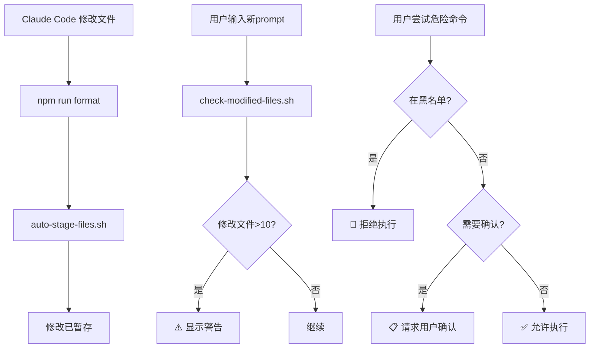

# Claude Code 安全使用指南

> 如何安全地使用Claude Code进行开发，避免数据丢失

**最后更新**：2025-11-05 16:30:00

---

## 🛡️ 已启用的安全防护

本项目已配置完整的Claude Code安全防护机制，包括：

### 1. 危险命令黑名单

以下命令**完全禁止**执行，尝试执行会被自动拒绝：

| 命令 | 风险等级 | 原因 |
|------|---------|------|
| `git restore` | 🔴 极高 | 会丢失未提交的修改 |
| `git reset --hard` | 🔴 极高 | 永久删除所有未提交的修改 |
| `git clean` | 🔴 极高 | 永久删除未跟踪文件 |
| `git checkout -- .` | 🔴 极高 | 丢失工作区所有修改 |
| `git checkout HEAD` | 🔴 极高 | 丢失指定文件修改 |
| `git stash drop` | 🟠 高 | 无法恢复已删除的暂存 |
| `git reflog delete` | 🟠 高 | 丢失Git历史记录 |
| `rm -rf` | 🔴 极高 | 递归强制删除文件 |

### 2. 需要确认的命令

以下命令需要**用户明确确认**后才能执行：

| 命令 | 风险等级 | 原因 |
|------|---------|------|
| `git reset` | 🟡 中 | 可能影响提交历史 |
| `git rebase` | 🟡 中 | 修改提交历史 |
| `git push --force` | 🟠 高 | 覆盖远程分支 |
| `git push -f` | 🟠 高 | 强制推送简写 |
| `git stash` | 🟡 中 | 暂存修改可能忘记恢复 |

### 3. 自动文件保护

- ✅ **自动暂存修改**：每次修改文件后自动 `git add -u`
- ✅ **修改数量提醒**：超过10个文件时自动警告
- ✅ **代码格式化**：自动运行 Prettier 和 ESLint

---

## 📋 安全操作指南

### ✅ 推荐的工作流程

```bash
# 1. Claude Code会自动暂存你的修改
# 你只需要定期提交

# 2. 查看暂存的修改
git status
git diff --cached

# 3. 提交代码
git commit -m "feat: 添加新功能"

# 4. 推送到远程
git push origin develop
```

### ⚠️ 回滚修改的正确方式

如果需要撤销修改，使用以下安全方法：

```bash
# 场景1：撤销单个文件的修改（文件仍在暂存区）
git checkout -- path/to/file

# 场景2：取消暂存（保留修改）
git reset HEAD path/to/file

# 场景3：查看历史版本（不修改文件）
git show HEAD:path/to/file

# 场景4：恢复到指定提交（创建新提交）
git revert <commit-hash>
```

### ❌ 不要使用的危险操作

```bash
# ❌ 这些命令会被Claude Code拒绝
git restore .           # 被禁止
git reset --hard        # 被禁止
git checkout -- .       # 被禁止
git clean -fd           # 被禁止

# ⚠️ 如果确实需要这些操作，请在终端手动执行
# 并确保你知道自己在做什么！
```

---

## 🚨 紧急情况处理

### 情况1：意外删除了文件

```bash
# 1. 检查文件是否在暂存区
git status

# 2. 如果在暂存区，可以恢复
git checkout HEAD -- path/to/file

# 3. 如果已提交，从历史恢复
git log -- path/to/file  # 找到文件的最后提交
git checkout <commit-hash> -- path/to/file
```

### 情况2：想要放弃所有修改

```bash
# ⚠️ 这是危险操作！请先备份

# 1. 创建备份分支
git branch backup-$(date +%Y%m%d-%H%M%S)

# 2. 在终端手动执行（不通过Claude Code）
git reset --hard HEAD

# 3. 如果后悔了，可以恢复
git checkout backup-xxx
```

### 情况3：需要临时禁用安全防护

**强烈不推荐！只在绝对必要时使用！**

编辑 `.claude/settings.local.json`：

```json
{
  "disableAllHooks": true  // 临时添加这一行
}
```

完成危险操作后，立即删除这一行！

---

## 📊 安全防护工作流程



---

## 💡 最佳实践

### 1. 频繁提交

```bash
# 不要累积太多修改
# 每完成一个功能就提交

git commit -m "feat: 实现用户登录"
git commit -m "fix: 修复密码验证bug"
git commit -m "docs: 更新API文档"
```

### 2. 使用有意义的提交信息

```bash
# ✅ 好的提交信息
git commit -m "feat: 添加用户头像上传功能"
git commit -m "fix: 修复登录页面样式错误"

# ❌ 不好的提交信息
git commit -m "update"
git commit -m "fix bug"
```

### 3. 定期推送到远程

```bash
# 每天工作结束前推送
git push origin develop

# 或者完成一个功能模块后推送
```

### 4. 使用分支保护主分支

```bash
# 不要直接在master/main分支开发
git checkout -b feature/new-feature

# 开发完成后提PR合并
```

---

## 🔗 相关文档

- **安全防护脚本**：[../.claude/scripts/README.md](../../.claude/scripts/README.md)
- **Claude Code配置**：[../.claude/settings.local.json](../../.claude/settings.local.json)
- **开发工作流**：[development-guide.md](development-guide.md)

---

## 🆘 获取帮助

如果遇到问题：

1. 查看 `.claude/scripts/README.md` 了解技术细节
2. 检查 `git status` 和 `git log` 了解当前状态
3. 联系团队成员获取帮助

**记住**：任何危险操作前都要先备份！

---

**维护者**：DuLiDay Team
**最后更新**：2025-11-05 16:30:00
